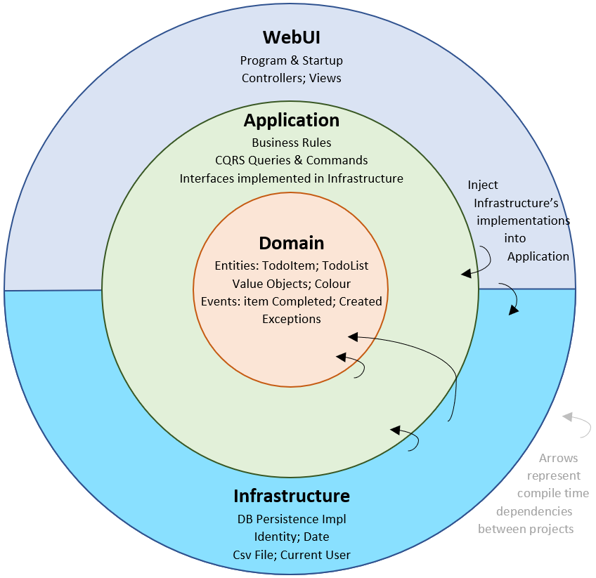

# Cluster Reply Code Challenge

## Technologien

- C\# .Net 9
- Aspire 

## Setup

1. Repository klonen
2. Docker starten
3. AppHost: https starten

## Projektbeschreibung

Cluster Reply Code-Challenge

## Architektur

Die Architektur orientiert sich an folgendem Diagramm:

## Kontakt

Moritz Waldau

